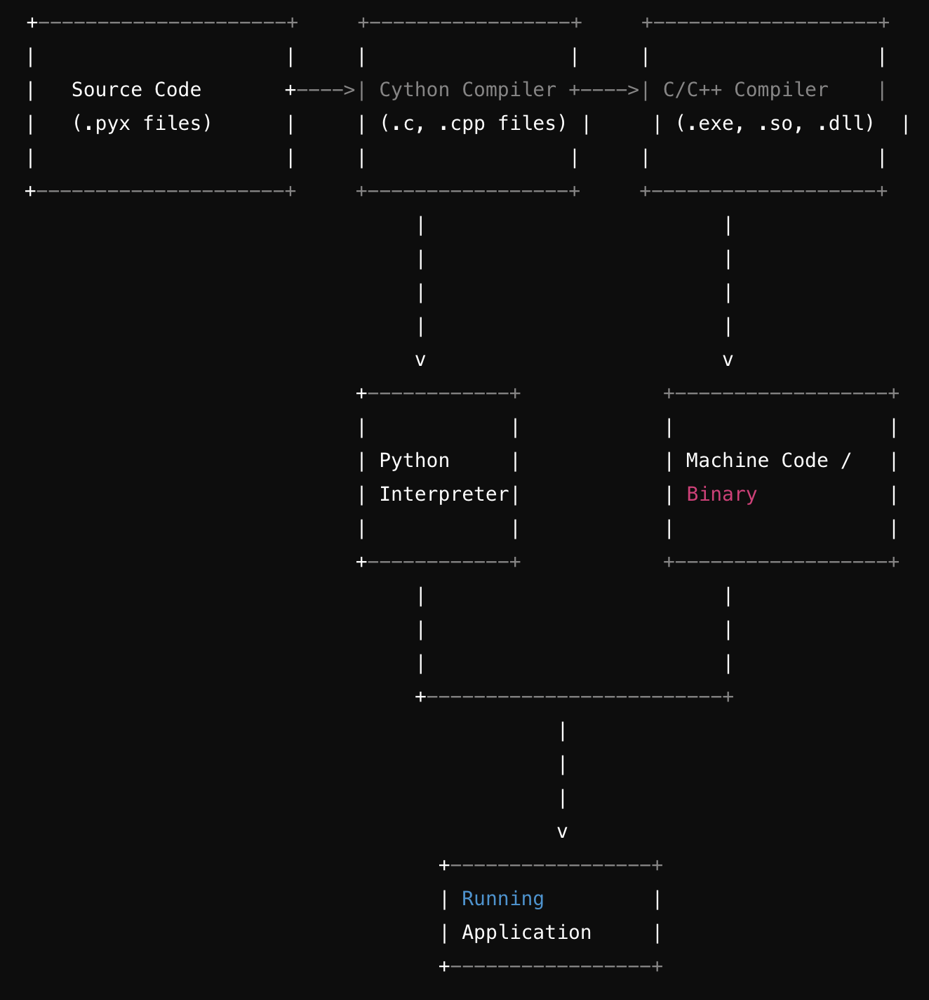

# CySpark Web Framework
CySpark is a lightweight web framework built using Cython and Python. It aims to provide high performance and efficiency by leveraging Cython's ability to compile Python-like code into optimized C or C++ code.

## Features
- **Performance**: Cython compilation results in faster execution compared to interpreted Python, making it suitable for applications requiring high throughput and low latency.
- **Customization**: Built for flexibility, CySpark allows developers to design and integrate specific features and optimizations tailored to their application's needs.
- **Integration**: Seamlessly integrates with existing C libraries, enabling direct utilization of high-performance modules for specialized tasks.
- **Control**: Provides low-level control over memory management and performance-critical operations, optimizing resource utilization.
- **Open for Improvements**: CySpark is an open-source project, welcoming contributions and enhancements from the community.

## Compilation Flow

- **Source Code (.pyx)**: CySpark's source code is primarily written in Cython (.pyx files), allowing seamless integration of Python-like syntax with C extensions.

- **Cython Compiler**: Cython compiles the .pyx files into low-level C or C++ code (.c or .cpp files), enriched with annotations to optimize performance.

- **C/C++ Compiler**: The C or C++ compiler translates the generated .c or .cpp files into machine-specific binary code (.exe, .so, .dll, etc.), ready for execution.

- **Machine Code / Binary**: The output of the C/C++ compiler is direct machine code executable by the computer's hardware.

- **Python Interpreter**: The Python interpreter executes the Python code that interacts with the compiled Cython extensions, facilitating dynamic and efficient web application handling.

- **Running Application**: Finally, the application runs, leveraging both Python functionality and optimized Cython components to process web requests and deliver responses efficiently.




## Getting Started
### Prerequisites
- Python 3.x
- Gcc compiler

### Installation
1. Clone the repository:

    ```bash
    git clone https://github.com/your/repository.git
    cd CySpark
    ```

2. Install the required dependencies:

    ```bash
    python setup.py build_ext --inplace
    ```

3. Start the CySpark server:

    ```bash
    python app.py
    ```

4. Open your web browser and visit `http://localhost:8080` to see the CySpark welcome page.

5. Enjoy building high-performance web applications with CySpark!

6. Feel free to contribute and improve the CySpark framework!

   


   
